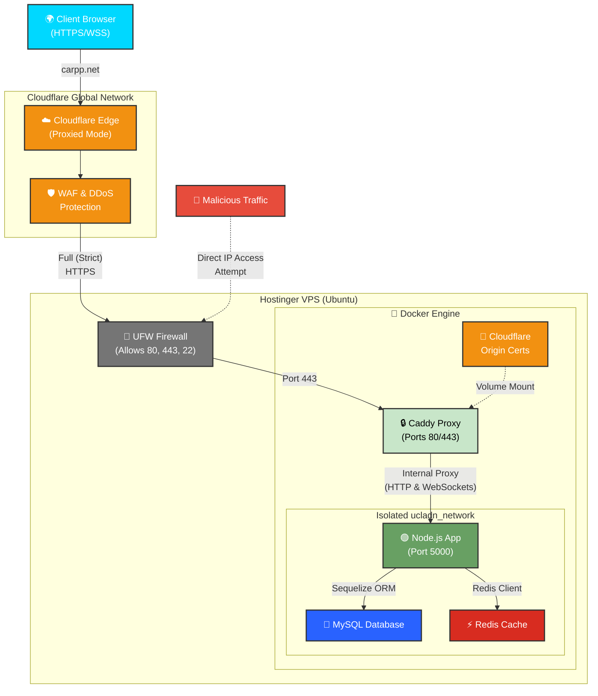

# UCLA DN Production Architecture

Diagram of the production architecture: Cloudflare Enterprise proxy, Caddy reverse proxy using Origin Certificates, and airgapped database containers.

```mermaid
flowchart TB
 subgraph subGraph0["Cloudflare Global Network"]
        CF["☁️ Cloudflare Edge<br>(Proxied Mode)"]
        WAF["🛡️ WAF &amp; DDoS<br>Protection"]
  end
 subgraph subGraph1["Isolated ucladn_network"]
        App["🟢 Node.js App<br>(Port 5000)"]
        MySQL["🐬 MySQL Database"]
        Redis["⚡ Redis Cache"]
  end
 subgraph subGraph2["🐳 Docker Engine"]
        Caddy["🔒 Caddy Proxy<br>(Ports 80/443)"]
        Certs["🔑 Cloudflare<br>Origin Certs"]
        subGraph1
  end
 subgraph subGraph3["Hostinger VPS (Ubuntu)"]
        UFW["🧱 UFW Firewall<br>(Allows 80, 443, 22)"]
        subGraph2
  end
    User["🌍 Client Browser<br>(HTTPS/WSS)"] -- "carpp.net" --> CF
    CF --> WAF
    WAF -- Full (Strict)<br>HTTPS --> UFW
    UFW -- Port 443 --> Caddy
    Certs -. Volume Mount .-> Caddy
    Caddy -- Internal Proxy<br>(HTTP &amp; WebSockets) --> App
    App -- Sequelize ORM --> MySQL
    App -- Redis Client --> Redis
    Hacker["👿 Malicious Traffic"] -. Direct IP Access<br>Attempt .-> UFW

     CF:::cloudflare
     WAF:::cloudflare
     App:::node
     MySQL:::db
     Redis:::cache
     Caddy:::proxy
     Certs:::secure
     UFW:::firewall
     User:::client
     Hacker:::client
    classDef client fill:#f9f9f9,stroke:#333,stroke-width:2px
    classDef cloudflare fill:#f38020,stroke:#333,stroke-width:2px,color:#fff
    classDef firewall fill:#e74c3c,stroke:#333,stroke-width:2px,color:#fff
    classDef proxy fill:#00d8ff,stroke:#333,stroke-width:2px,color:#000
    classDef node fill:#68a063,stroke:#333,stroke-width:2px,color:#fff
    classDef db fill:#f29111,stroke:#333,stroke-width:2px,color:#fff
    classDef cache fill:#d82c20,stroke:#333,stroke-width:2px,color:#fff
    classDef secure fill:#2ecc71,stroke:#333,stroke-width:2px,color:#fff
    style CF fill:#f29111
    style WAF fill:#f29111
    style MySQL fill:#2962FF
    style Caddy fill:#C8E6C9
    style Certs fill:#f29111
    style UFW fill:#757575
    style User fill:#00d8ff
    style Hacker fill:#e74c3c
```
