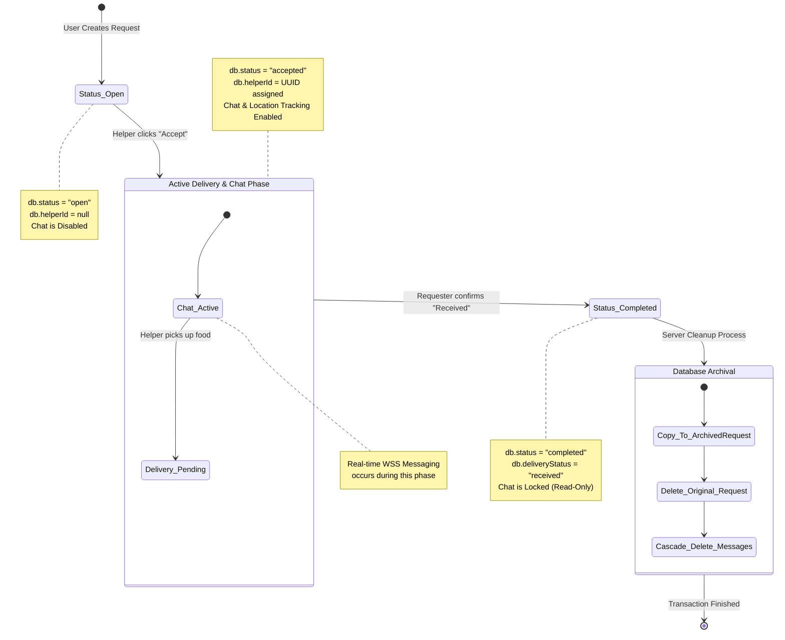

# Request & Chat State Lifecycle

This diagram maps out the complete lifecycle of a Delivery Request, from its initial creation as an "Open" order to the final Archival process where the chat is permanently deleted.

