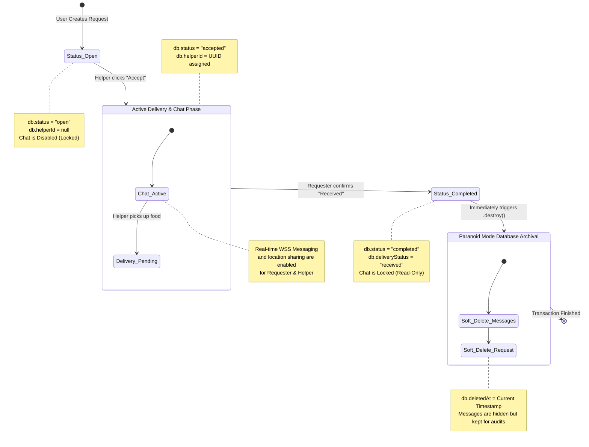

# Request & Chat State Lifecycle

This diagram maps out the complete lifecycle of a Delivery Request and how it affects the state of the Chat functionality, from its initial creation as an "Open" order to the final Archival process where the chat is permanently locked and soft-deleted.

