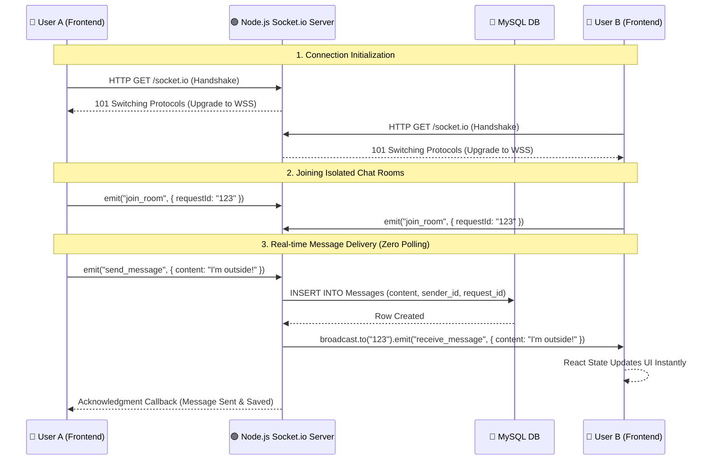

# Real-time WebSocket Chat Architecture

This diagram visualizes how the application handles instant, real-time messaging using Socket.io, replacing the old, inefficient HTTP short-polling mechanism.

