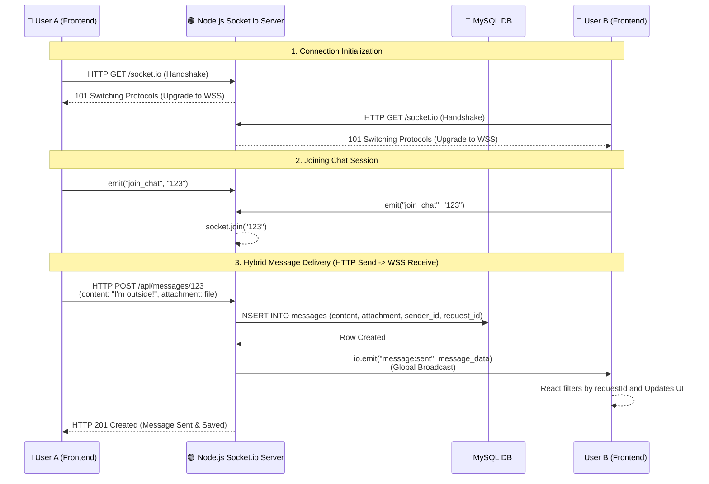

# Real-time WebSocket Chat Architecture

This diagram visualizes how the application handles instant, real-time messaging using a hybrid approach: HTTP POST requests for sending messages (to support file uploads) and Socket.io global broadcasts for real-time delivery.

