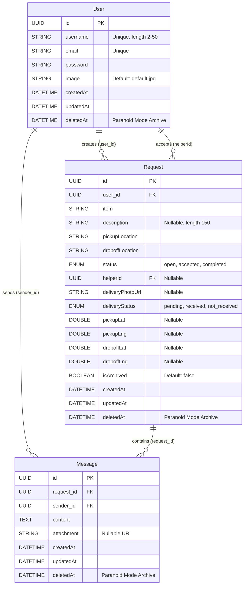

# MySQL Entity-Relationship Diagram

This diagram visualizes the exact relational schema and associations as currently defined in the backend Sequelize models.

```mermaid
erDiagram
    User {
        UUID id PK
        STRING username "Unique, length 2-50"
        STRING email "Unique"
        STRING password
        STRING image "Default: default.jpg"
        DATETIME createdAt
        DATETIME updatedAt
        DATETIME deletedAt "Paranoid Mode Archive"
    }

    Request {
        UUID id PK
        UUID user_id FK
        STRING item
        STRING description "Nullable, length 150"
        STRING pickupLocation
        STRING dropoffLocation
        ENUM status "open, accepted, completed"
        UUID helperId FK "Nullable"
        STRING deliveryPhotoUrl "Nullable"
        ENUM deliveryStatus "pending, received, not_received"
        DOUBLE pickupLat "Nullable"
        DOUBLE pickupLng "Nullable"
        DOUBLE dropoffLat "Nullable"
        DOUBLE dropoffLng "Nullable"
        BOOLEAN isArchived "Default: false"
        DATETIME createdAt
        DATETIME updatedAt
        DATETIME deletedAt "Paranoid Mode Archive"
    }

    Message {
        UUID id PK
        UUID request_id FK
        UUID sender_id FK
        TEXT content
        STRING attachment "Nullable URL"
        DATETIME createdAt
        DATETIME updatedAt
        DATETIME deletedAt "Paranoid Mode Archive"
    }

    User ||--o{ Request : "creates (user_id)"
    User ||--o{ Request : "accepts (helperId)"
    User ||--o{ Message : "sends (sender_id)"
    Request ||--o{ Message : "contains (request_id)"
```
