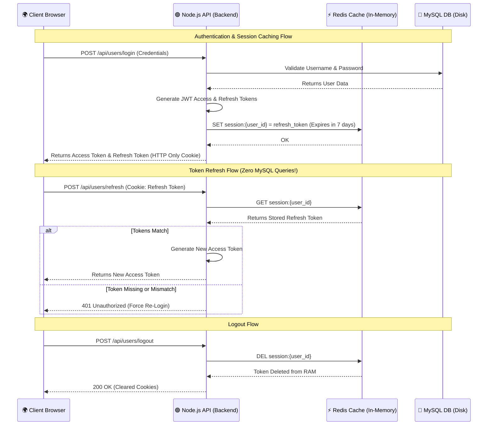

# Redis Session Management Architecture

This diagram visualizes how Redis is utilized as an extremely fast, in-memory cache to handle JWT Refresh Token sessions without overloading the primary MySQL database.

