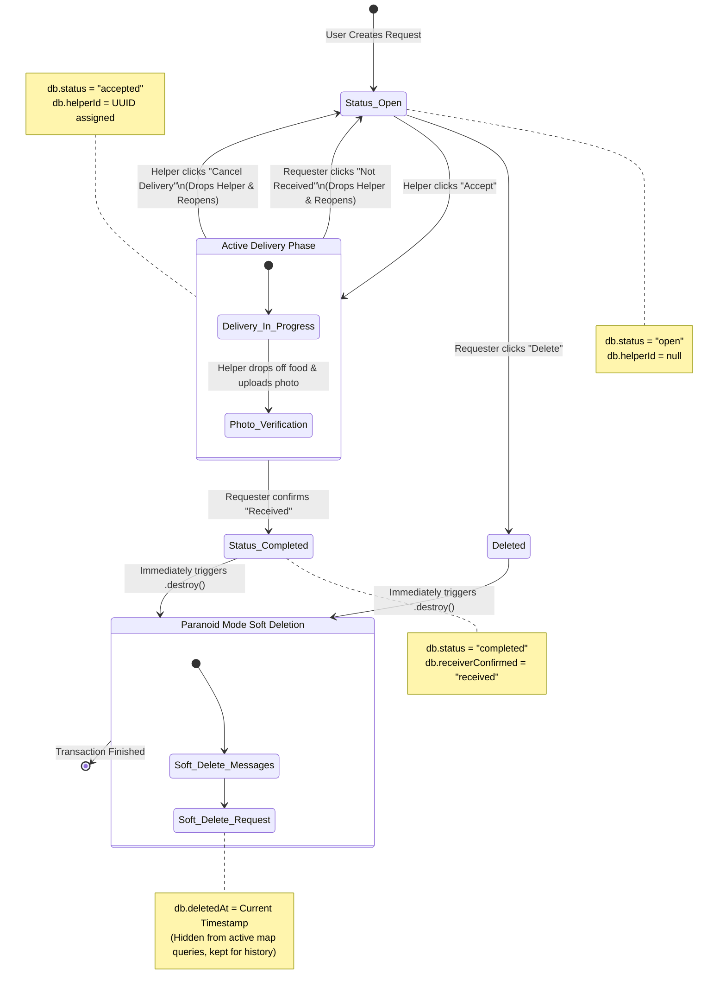

# Request Lifecycle Diagram

This diagram maps out the complete flow of a Delivery Request, covering the standard path (Open -> Accepted -> Completed), as well as edge cases like manual deletion, cancellation, and disputed drop-offs ("Not Received").

